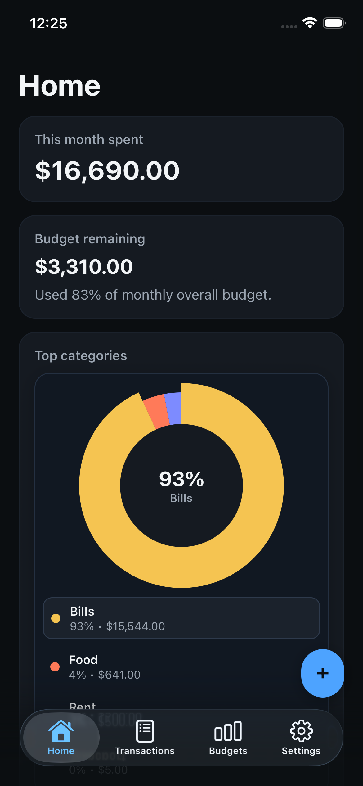
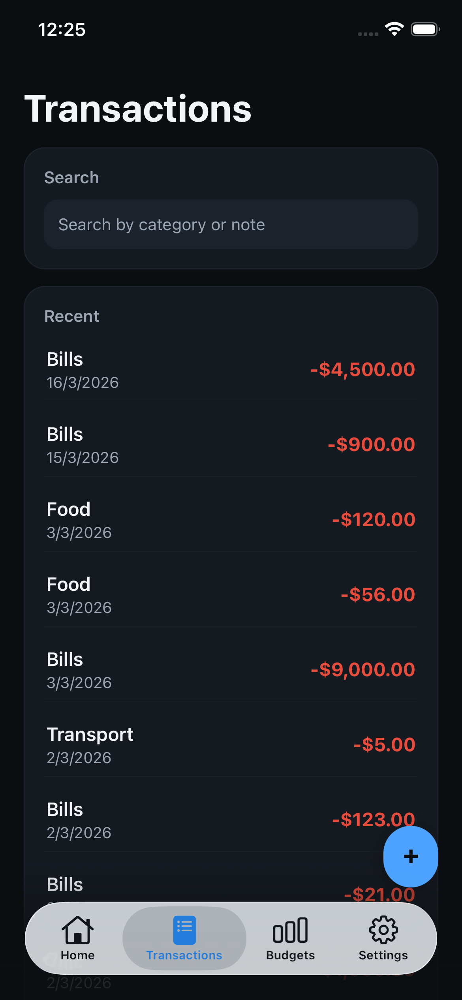
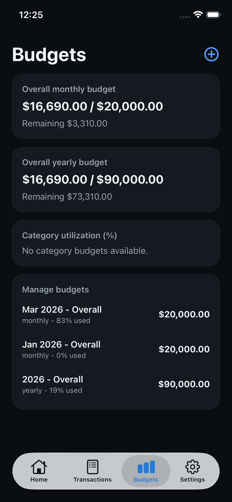

# Quick Track

Quick Track is an iOS-first personal expense tracker built with Expo + React Native.

The app focuses on fast transaction capture, clear monthly budget visibility, and reliable offline-first behavior.

## Preview

<p align="center">
  
  
  
</p>

## Features (MVP)

- Email/password authentication with Supabase Auth
- Fast add/edit/delete/duplicate transactions
- Category-based tracking and filtering
- Monthly/yearly budgets with threshold warnings
- Offline-first data entry with background sync
- Dashboard metrics for month spend, income, net, and top categories
- CSV export from local data
- Siri Shortcut support for quick add (iOS dev build)

## Tech Stack

- Expo (managed workflow) + React Native + TypeScript
- Expo Router for navigation
- Supabase (Postgres, Auth, RLS)
- SQLite (`expo-sqlite`) for local persistence
- React Hook Form + Zod for forms and validation
- `react-native-gifted-charts` for charts

## Quick Start

### 1. Install dependencies

```bash
npm install
```

### 2. Configure environment

Create `.env` in project root:

```bash
SUPABASE_URL=http://127.0.0.1:54321
SUPABASE_ANON_KEY=your_anon_key
```

### 3. Run the app

```bash
npm run start
```

Use:

- `npm run ios` for iOS simulator/device
- `npm run android` for Android
- `npm run web` for web preview

## Local Supabase (Optional)

If you are running the backend locally:

```bash
supabase start
supabase db reset
```

Then use the URL and anon key output by the Supabase CLI in `.env`.

## Scripts

- `npm run start` - start Expo dev server
- `npm run ios` - run iOS build
- `npm run android` - run Android build
- `npm run web` - run web target
- `npm run lint` - run lint checks

## Project Structure

```text
app/                  Expo Router routes
src/features/         Product features (home, transactions, budgets, settings, etc.)
src/data/local/       SQLite schema, queries, migrations
src/data/remote/      Supabase integration
src/data/sync/        Offline outbox + sync engine
src/shared/           Shared UI, theme, utilities, types
supabase/migrations/  Database schema + RLS migrations
```

## Product Constraints (Current MVP)

- Dark mode only
- AUD currency only
- iOS-first UX

## Contributing

1. Create a branch from `main`
2. Make focused changes with clear commit messages
3. Run `npm run lint`
4. Open a pull request with a short test/verification summary

## License

No license has been added yet.
